# Agent Architecture Flowchart

```mermaid
flowchart TD
    %% ─────────────────────────────────────
    %% ENTRY POINTS
    %% ─────────────────────────────────────
    USER(["👤 Customer Request"])
    PHARM_USER(["💊 Pharmacist Request"])
    SCHEDULER(["⏰ Scheduler / Cron Job"])

    %% ─────────────────────────────────────
    %% CHAT PIPELINE
    %% ─────────────────────────────────────
    subgraph CHAT_PIPELINE ["🗨️ Customer Chat Pipeline"]
        direction TB
        IG["🛡️ Input Guard\n(pharmacy_input_guardrail)\n──────────────────\n✅ ALLOWED / ❌ BLOCKED"]
        PA["🧠 Parent Agent\n(Parent_Agent)\n──────────────────\nRoutes by intent"]
        OG["🛡️ Output Guard\n(pharmacy_output_guardrail)\n──────────────────\n✅ SAFE / ❌ UNSAFE"]

        subgraph CHAT_CHILDREN ["Child Agents"]
            RA["💬 Receptionist\n(medicine_advisor_stock_reader)"]
            OA["🛒 Order Maker\n(order_maker)"]
        end

        subgraph CHAT_TOOLS ["Chat Tools"]
            T_STOCK["checkStock"]
            T_SEARCH["searchMedByDescription"]
            T_DESC["describeMed"]
            T_INTERACT["checkDrugInteractions"]
            T_ORDER["order_medicine"]
            T_PRESC["checkPrescriptionOnFile"]
            T_PAY["create_payment"]
        end
    end

    %% ─────────────────────────────────────
    %% PHARMACIST PIPELINE
    %% ─────────────────────────────────────
    subgraph PHARMA_PIPELINE ["💊 Pharmacist Pipeline"]
        direction TB
        PIG["🛡️ Pharmacist Input Guard\n(pharmacistInputGuardrail)"]
        PP["🧠 Parent Pharmacist\n(parent_pharmacist)\n──────────────────\nRoutes by intent"]
        POG["🛡️ Pharmacist Output Guard\n(pharmacistOutputGuardrail)"]

        subgraph PHARMA_CHILDREN ["Child Agents"]
            SA["📦 Stock Add\n(stockAddAgent)"]
            SR["📉 Stock Reduce\n(stockReduceAgent)"]
            OS["🔄 Order Status\n(orderStatusChangeAgent)"]
            IS["📊 Inventory Suggestion\n(inventorySuggestionAgent)"]
            PO["🏭 Place Order\n(placeOrderAgent)"]
            AM["➕ Add Medicine\n(addMedicineAgent)"]
            RM["➖ Remove Medicine\n(removeMedicineAgent)"]
        end

        subgraph PHARMA_TOOLS ["Pharmacist Tools"]
            PT1["addStockTool"]
            PT2["reduceStockTool"]
            PT3["getOrdersTool\nchangeOrderStatusTool"]
            PT4["getRecentTransactionsTool"]
            PT5["placeOrderTool"]
            PT6["addMedicineTool"]
            PT7["removeMedicineTool"]
        end
    end

    %% ─────────────────────────────────────
    %% NOTIFICATION PIPELINE
    %% ─────────────────────────────────────
    subgraph NOTIFY_PIPELINE ["🔔 Notification Pipeline"]
        direction TB
        ND["🧠 Notification Dispatcher\n(notification_dispatcher)\n──────────────────\nRoutes by task type"]

        subgraph NOTIFY_CHILDREN ["Child Agents"]
            MN["💊 Medication Notifier\n(medication_notifier)"]
            RR["🔁 Refill Reminder\n(refill_reminder_agent)"]
        end

        subgraph NOTIFY_TOOLS ["Notification Tools"]
            NT1["fetchDosesTool"]
            NT2["sendEmailTool"]
            NT3["fetchRefillsTool"]
        end
    end

    %% ─────────────────────────────────────
    %% LEGACY ORCHESTRATOR
    %% ─────────────────────────────────────
    subgraph ORCH ["⚙️ Legacy Orchestrator Agent"]
        direction TB
        ORC["🤖 Orchestrator\n(runOrchestrator)\n──────────────────\nAgentic Loop / GPT-4o"]
        subgraph ORCH_TOOLS ["Legacy Tools"]
            OT1["check_inventory"]
            OT2["validate_prescription"]
            OT3["create_order"]
            OT4["check_warehouse"]
            OT5["check_refill_eligibility"]
        end
    end

    %% ─────────────────────────────────────
    %% FLOW CONNECTIONS — CHAT
    %% ─────────────────────────────────────
    USER --> IG
    IG -- "✅ ALLOWED" --> PA
    IG -- "❌ BLOCKED" --> BLOCK1(["🚫 Blocked Response"])
    PA -- "Search / Stock / Info" --> RA
    PA -- "Order / Buy / Prescription" --> OA
    RA --> T_STOCK & T_SEARCH & T_DESC & T_INTERACT
    OA --> T_ORDER & T_PRESC & T_PAY
    PA --> OG
    OG -- "✅ SAFE" --> CHAT_OUT(["📤 Response to Customer"])
    OG -- "❌ UNSAFE" --> BLOCK2(["🚫 Blocked Response"])

    %% ─────────────────────────────────────
    %% FLOW CONNECTIONS — PHARMACIST
    %% ─────────────────────────────────────
    PHARM_USER --> PIG
    PIG -- "✅ ALLOWED" --> PP
    PIG -- "❌ BLOCKED" --> BLOCK3(["🚫 Blocked Response"])
    PP -- "Add Stock" --> SA --> PT1
    PP -- "Reduce Stock" --> SR --> PT2
    PP -- "Order Status" --> OS --> PT3
    PP -- "Suggestions" --> IS --> PT4
    PP -- "Place Order" --> PO --> PT5
    PP -- "Add Medicine" --> AM --> PT6
    PP -- "Remove Medicine" --> RM --> PT7
    PP --> POG
    POG -- "✅ SAFE" --> PHARMA_OUT(["📤 Response to Pharmacist"])
    POG -- "❌ UNSAFE" --> BLOCK4(["🚫 Blocked Response"])

    %% ─────────────────────────────────────
    %% FLOW CONNECTIONS — NOTIFICATION
    %% ─────────────────────────────────────
    SCHEDULER --> ND
    ND -- "Daily dose reminder" --> MN
    ND -- "Expiring prescriptions / low stock" --> RR
    MN --> NT1 & NT2
    RR --> NT3 & NT2

    %% ─────────────────────────────────────
    %% FLOW CONNECTIONS — LEGACY
    %% ─────────────────────────────────────
    USER -.->|"Legacy Route"| ORC
    ORC <--> OT1 & OT2 & OT3 & OT4 & OT5

    %% ─────────────────────────────────────
    %% STYLES
    %% ─────────────────────────────────────
    classDef parent fill:#4A90D9,stroke:#2C5F8A,color:#fff,font-weight:bold
    classDef child fill:#5BAD6F,stroke:#3A7A4A,color:#fff
    classDef guard fill:#E8A838,stroke:#B07820,color:#fff,font-weight:bold
    classDef tool fill:#9B59B6,stroke:#6C3483,color:#fff
    classDef entry fill:#2ECC71,stroke:#1A8A4A,color:#fff,font-weight:bold
    classDef block fill:#E74C3C,stroke:#A93226,color:#fff
    classDef legacy fill:#95A5A6,stroke:#717D7E,color:#fff

    class PA,PP,ND parent
    class RA,OA,SA,SR,OS,IS,PO,AM,RM,MN,RR child
    class IG,OG,PIG,POG guard
    class T_STOCK,T_SEARCH,T_DESC,T_INTERACT,T_ORDER,T_PRESC,T_PAY,PT1,PT2,PT3,PT4,PT5,PT6,PT7,NT1,NT2,NT3,OT1,OT2,OT3,OT4,OT5 tool
    class USER,PHARM_USER,SCHEDULER entry
    class BLOCK1,BLOCK2,BLOCK3,BLOCK4 block
    class ORC legacy
```

## Pipeline Summary

| Pipeline | Entry | Parent Agent | Child Agents | Guards |
|---|---|---|---|---|
| **Customer Chat** | User message | `Parent_Agent` | Receptionist, Order Maker | Input + Output |
| **Pharmacist** | Pharmacist message | `parent_pharmacist` | StockAdd, StockReduce, OrderStatus, Suggestion, PlaceOrder, AddMedicine, RemoveMedicine | Input + Output |
| **Notification** | Scheduler / Cron | `notification_dispatcher` | Medication Notifier, Refill Reminder | None |
| **Legacy Orchestrator** | Direct API call | `runOrchestrator` | — (agentic tool-loop) | None |

## Color Legend

| Color | Meaning |
|---|---|
| 🔵 Blue | Parent / Router agents |
| 🟢 Green | Child specialist agents |
| 🟡 Orange | Guardrails (Input / Output) |
| 🟣 Purple | Tools |
| ⚪ Gray | Legacy orchestrator |
| 🔴 Red | Blocked responses |
