# Architecture Overview

MediSage is a **MERN monorepo** with a clear client–server split. The backend exposes a REST + Socket.IO interface; the frontend consumes it through Axios and Socket.IO-client.

---

## Demo

> See the full system architecture explained live.

[](https://youtu.be/PLACEHOLDER_ARCH)

---

## High-Level Diagram

```
┌─────────────────────────────────────────────────────────────┐
│                        FRONTEND (React 19)                   │
│  ┌──────────┐  ┌───────────┐  ┌────────────┐  ┌─────────┐  │
│  │ ChatPage │  │ AdminDash │  │ My Orders  │  │My Presc.│  │
│  └────┬─────┘  └─────┬─────┘  └─────┬──────┘  └────┬────┘  │
│       │  Zustand store / Axios API / Socket.IO-client        │
└───────┼──────────────────────────────────────────────────────┘
        │ HTTPS REST         │ WebSocket (Socket.IO)
        ▼                    ▼
┌─────────────────────────────────────────────────────────────┐
│                    BACKEND (Express / Node ESM)              │
│                                                              │
│  Routes → Rate Limiter (Redis) → Auth (JWT) → Controllers   │
│                                                              │
│  ┌─────────────────────────────────────────────┐            │
│  │             AI Agent Orchestrator            │            │
│  │  Input Guard → Parent Agent → Child Agents  │            │
│  │        → Tools → Output Guard               │            │
│  └───────────────────┬─────────────────────────┘            │
│                       │ OpenAI Agents SDK                    │
│  ┌────────┐  ┌──────┐ │ ┌─────────┐  ┌────────┐  ┌───────┐ │
│  │MongoDB │  │Redis │ │ │Cloudinary│  │Razorpay│  │Resend │ │
│  └────────┘  └──────┘   └─────────┘  └────────┘  └───────┘ │
└─────────────────────────────────────────────────────────────┘
```

---

## Multi-Agent Swarm Diagram

```mermaid
flowchart TD
    USER(["👤 Customer"])
    PHARM_USER(["💊 Pharmacist/Admin"])
    SCHEDULER(["⏰ Cron / Scheduler"])

    subgraph CHAT ["🗨️ Customer Chat Pipeline"]
        direction TB
        IG["🛡️ Input Guard\n(pharmacy_input_guardrail)\n──────────────────\n✅ ALLOWED / ❌ BLOCKED"]
        PA["🧠 Parent Chat Agent\n(Parent_Agent)\n──────────────────\nRoutes by intent"]
        OG["🛡️ Output Guard\n(pharmacy_output_guardrail)\n──────────────────\n✅ SAFE / ❌ UNSAFE"]

        subgraph CHAT_CHILDREN ["Child Agents"]
            RA["💬 Receptionist\n(medicine_advisor_stock_reader)"]
            OA["🛒 Order Maker\n(order_maker)"]
        end

        subgraph CHAT_TOOLS ["Chat Tools"]
            T_STOCK["checkStock"]
            T_SEARCH["searchMedByDescription"]
            T_DESC["describeMed"]
            T_ORDER["order_medicine"]
            T_PRESC["checkPrescriptionOnFile"]
            T_PAY["create_payment"]
        end
    end

    subgraph PHARMA ["💊 Pharmacist Pipeline"]
        direction TB
        PIG["🛡️ Pharmacist Input Guard\n(pharmacistInputGuardrail)"]
        PP["🧠 Parent Pharmacist\n(parent_pharmacist)\n──────────────────\nRoutes by intent"]
        POG["🛡️ Pharmacist Output Guard\n(pharmacistOutputGuardrail)"]

        subgraph PHARMA_CHILDREN ["Child Agents"]
            SA["📦 Stock Add\n(stockAddAgent)"]
            SR["📉 Stock Reduce\n(stockReduceAgent)"]
            OS["🔄 Order Status\n(orderStatusChangeAgent)"]
            IS["📊 Inventory Suggestion\n(inventorySuggestionAgent)"]
            PO["🏭 Place Order\n(placeOrderAgent)"]
            AM["➕ Add Medicine\n(addMedicineAgent)"]
            RM["➖ Remove Medicine\n(removeMedicineAgent)"]
        end

        subgraph PHARMA_TOOLS ["Pharmacist Tools"]
            PT1["addStockTool"]
            PT2["reduceStockTool"]
            PT3["getOrdersTool\nchangeOrderStatusTool"]
            PT4["getRecentTransactionsTool"]
            PT5["placeOrderTool"]
            PT6["addMedicineTool"]
            PT7["removeMedicineTool"]
        end
    end

    subgraph NOTIFY ["🔔 Notification Pipeline"]
        direction TB
        ND["🧠 Notification Dispatcher\n(notification_dispatcher)\n──────────────────\nRoutes by task type"]

        subgraph NOTIFY_CHILDREN ["Child Agents"]
            MN["💊 Medication Notifier\n(medication_notifier)\n8 AM dose reminders"]
            RR["🔁 Refill Reminder\n(refill_reminder_agent)\n10 AM expiry alerts"]
            OCR["🔍 Image Data Extractor\n(img_data_extractor)\nPrescription OCR"]
        end

        subgraph NOTIFY_TOOLS ["Notification Tools"]
            NT1["fetchDosesTool"]
            NT2["sendEmailTool"]
            NT3["fetchRefillsTool"]
            NT4["OCR_Tool\n(Vision model)"]
            NT5["verifyPrescriptionTool"]
        end
    end

    USER --> IG
    IG -- "✅ ALLOWED" --> PA
    IG -- "❌ BLOCKED" --> B1(["🚫 Rejected"])
    PA -- "Search / Stock / Info" --> RA
    PA -- "Order / Buy / Rx" --> OA
    RA --> T_STOCK & T_SEARCH & T_DESC
    OA --> T_ORDER & T_PRESC & T_PAY
    PA --> OG
    OG -- "✅ SAFE" --> CHAT_OUT(["📤 Response to Customer"])
    OG -- "❌ UNSAFE" --> B2(["🚫 Rejected"])

    PHARM_USER --> PIG
    PIG -- "✅ ALLOWED" --> PP
    PIG -- "❌ BLOCKED" --> B3(["🚫 Rejected"])
    PP -- "Add Stock" --> SA --> PT1
    PP -- "Reduce Stock" --> SR --> PT2
    PP -- "Order Status" --> OS --> PT3
    PP -- "Suggestions" --> IS --> PT4
    PP -- "Place Order" --> PO --> PT5
    PP -- "Add Medicine" --> AM --> PT6
    PP -- "Remove Medicine" --> RM --> PT7
    PP --> POG
    POG -- "✅ SAFE" --> PHARMA_OUT(["📤 Response to Pharmacist"])
    POG -- "❌ UNSAFE" --> B4(["🚫 Rejected"])

    SCHEDULER --> ND
    ND -- "Daily dose reminder" --> MN --> NT1 & NT2
    ND -- "Expiry / refill alerts" --> RR --> NT3 & NT2
    ND -- "Prescription upload" --> OCR --> NT4 & NT5

    classDef parent  fill:#4A90D9,stroke:#2C5F8A,color:#fff,font-weight:bold
    classDef child   fill:#5BAD6F,stroke:#3A7A4A,color:#fff
    classDef guard   fill:#E8A838,stroke:#B07820,color:#fff,font-weight:bold
    classDef tool    fill:#9B59B6,stroke:#6C3483,color:#fff
    classDef entry   fill:#2ECC71,stroke:#1A8A4A,color:#fff,font-weight:bold
    classDef block   fill:#E74C3C,stroke:#A93226,color:#fff

    class PA,PP,ND parent
    class RA,OA,SA,SR,OS,IS,PO,AM,RM,MN,RR,OCR child
    class IG,OG,PIG,POG guard
    class T_STOCK,T_SEARCH,T_DESC,T_ORDER,T_PRESC,T_PAY,PT1,PT2,PT3,PT4,PT5,PT6,PT7,NT1,NT2,NT3,NT4,NT5 tool
    class USER,PHARM_USER,SCHEDULER entry
    class B1,B2,B3,B4 block
```



---

## Pipeline Summary

| Pipeline | Entry | Parent Agent | Child Agents | Guards |
|---|---|---|---|---|
| **Customer Chat** | User message | `Parent_Agent` | Receptionist, Order Maker | Input + Output |
| **Pharmacist** | Pharmacist message | `parent_pharmacist` | StockAdd, StockReduce, OrderStatus, Suggestion, PlaceOrder, AddMedicine, RemoveMedicine | Input + Output |
| **Notification** | Scheduler / Cron | `notification_dispatcher` | Medication Notifier, Refill Reminder, Image Data Extractor (OCR) | None |

---

## Request Lifecycle

### REST Request

```
Client
  → Axios (with Bearer token header)
  → Express Router
  → Rate Limiter (Redis)
  → Auth Middleware (JWT verify)
  → Zod Validation
  → Controller
  → Service / Model
  → JSON Response
```

### Chat Request (Streaming)

```
Client
  → POST /api/chat/stream
  → Controller opens SSE / ReadableStream response
  → Agent Orchestrator runs agentic loop
  → Tokens streamed back via res.write()
  → Frontend reads fetch ReadableStream
```

### Socket.IO Event

```
Admin updates order status
  → PATCH /api/admin/orders/:id
  → Controller emits socket events:
      io.to(`user:<userId>`).emit('order:dispatched', {...})
      io.emit('order:admin-updated', {...})
  → Frontend SocketContext receives event
  → Toast notification + state update
```

---

## Key Design Principles

| Principle | Implementation |
|---|---|
| **Separation of concerns** | Routes → Controllers → Services → Models; no business logic in routes |
| **Stateless REST** | JWT in every request; no server-side session |
| **Real-time via sockets** | All live notifications go through Socket.IO, not polling |
| **Agent isolation** | Each agent has a defined scope; parent orchestrates, children execute |
| **Caching** | Redis caches chat session history + rate limits to avoid repeated DB reads |
| **Security-first** | Rate limiting, CORS whitelist, HMAC webhook verification, bcrypt, injection guardrails |

---

## Monorepo Layout

```
HackFusion-2k26-Team-LUXRAY-/
├── backend/
│   ├── src/
│   │   ├── agent/          # AI orchestration (parent, child, guard, tools, service)
│   │   │   ├── parent/     # parentChat, parentNotify, parentPharmacist
│   │   │   ├── child/      # chat/, notify/, pharamcist/ sub-folders
│   │   │   ├── guard/      # input/output guardrails (chat + pharmacist)
│   │   │   ├── tools/      # chat/, notify_tool/, pharamcist/ tool sets
│   │   │   └── service/    # agent-internal services
│   │   ├── config/         # DB, Redis, Cloudinary, OpenAI, Socket.IO
│   │   ├── controllers/    # Request handlers
│   │   ├── middleware/      # Auth, multer, validation, rate limiter
│   │   ├── models/         # Mongoose schemas (9 models)
│   │   ├── routes/         # Express routers (11 routes)
│   │   ├── scheduler/      # node-cron jobs (refill + notification)
│   │   ├── services/       # Business logic (cloudinary, email, order, etc.)
│   │   └── utils/          # Logger, helpers, agentLogger
│   ├── package.json        # ESM module
│   └── .env.example
│
├── frontend/
│   ├── src/
│   │   ├── components/     # UI components (chat, admin, auth, avatar, layout)
│   │   ├── context/        # SocketContext
│   │   ├── features/       # Feature-scoped components (prescription, voice)
│   │   ├── hooks/          # useChat, useScreenRecorder, useAudioAmplitude, useDarkMode
│   │   ├── pages/          # Route-level page components
│   │   ├── services/       # Axios API client, socket wrapper
│   │   ├── store/          # Zustand stores (useAppStore, useAuthStore)
│   │   └── utils/          # Formatters, invoice generator, output parser
│   ├── vite.config.js
│   └── package.json
│
└── docs/                   # Docusaurus documentation
```

---

## Authentication & Role Model

```
Roles: customer | admin | pharmacist

JWT payload: { id, role }
Token stored in: localStorage['pharmacy_token']
Header: Authorization: Bearer <token>

Socket auth: socket.handshake.auth.token
Socket rooms: user:<userId>  (personal notifications)
```

Access control:
- `protect` — verifies JWT, attaches `req.user`
- `restrictTo('admin', 'pharmacist')` — role guard for admin routes
